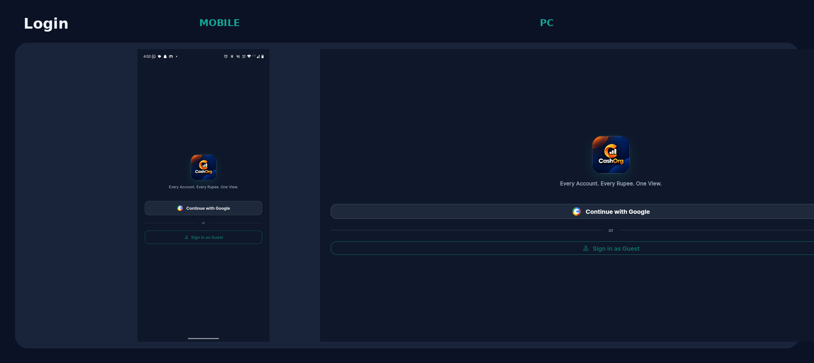
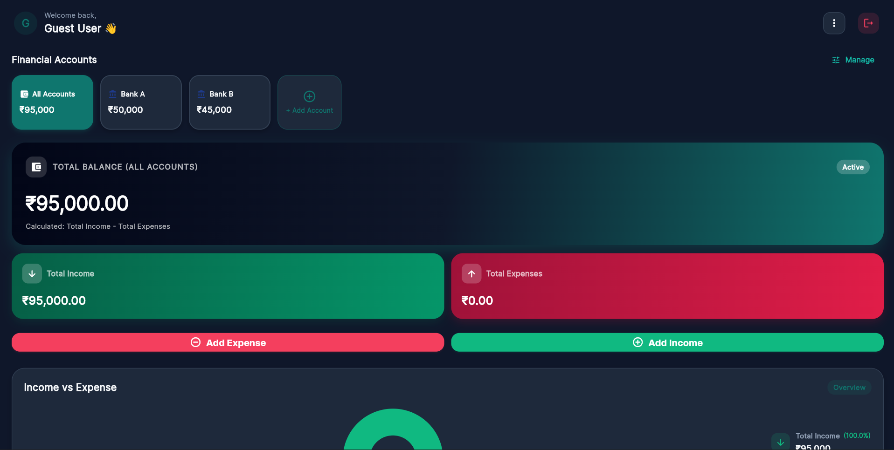
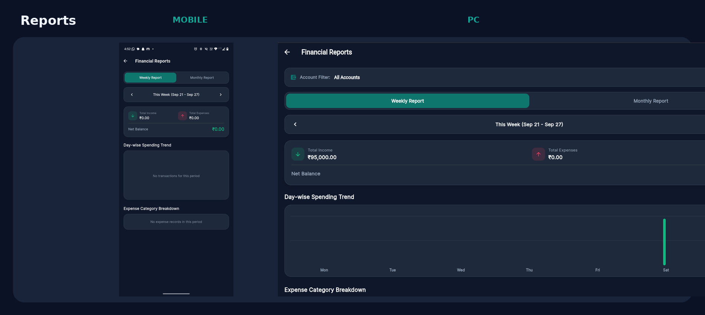

# CashOrg

> Every Account. Every Rupee. One View.

CashOrg is a personal finance management mobile application that helps users manage multiple bank and cash accounts, track income and expenses account-wise, monitor balances, and understand their spending through charts and reports.

## Features

- Google Sign-In
- Guest Mode
- Multiple Bank & Cash Accounts
- Add, Edit and Delete Accounts
- Account-wise Income Tracking
- Account-wise Expense Tracking
- Automatic Account Balance Updates
- Category-based Transactions
- Overall Expense & Income Dashboard
- Account-specific Expense Charts
- Weekly & Monthly Reports
- User-specific Data
- Supabase Cloud Database
- Multi-device Data Sync
- Dark / Light Theme
- Responsive Mobile UI

## Tech Stack

- Flutter
- Dart
- Supabase
- PostgreSQL
- Google Authentication

## How It Works

1. Sign in using Google or continue as a Guest.
2. Create your bank or cash accounts.
3. Add income to the appropriate account.
4. Add expenses and select the account from which the money was spent.
5. CashOrg automatically updates the selected account balance.
6. View spending patterns through charts and reports.

## Example

If a user has:

- HDFC Bank – ₹25,000
- SBI Bank – ₹15,000
- Cash – ₹5,000

and spends ₹2,000 from SBI:

SBI balance becomes ₹13,000 while HDFC and Cash remain unchanged.

## Database

CashOrg uses Supabase for authentication and cloud data storage.

User data is isolated using user-specific records and Row Level Security (RLS).

## Security

- Supabase Authentication
- Row Level Security
- User-specific financial data
- No service-role keys exposed in the mobile application

## Screenshots

### Login

### Dashboard

### Reports

## Installation

Clone the repository:

git clone YOUR_REPOSITORY_URL

- [Learn Flutter](https://docs.flutter.dev/get-started/learn-flutter)
- [Write your first Flutter app](https://docs.flutter.dev/get-started/codelab)
- [Dart](https://img.shields.io/badge/Dart-Language-blue)
- [Supabase](https://img.shields.io/badge/Supabase-Backend-green)
- [Flutter learning resources](https://docs.flutter.dev/reference/learning-resources)

For help getting started with Flutter development, view the
[online documentation](https://docs.flutter.dev/), which offers tutorials,
samples, guidance on mobile development, and a full API reference.
